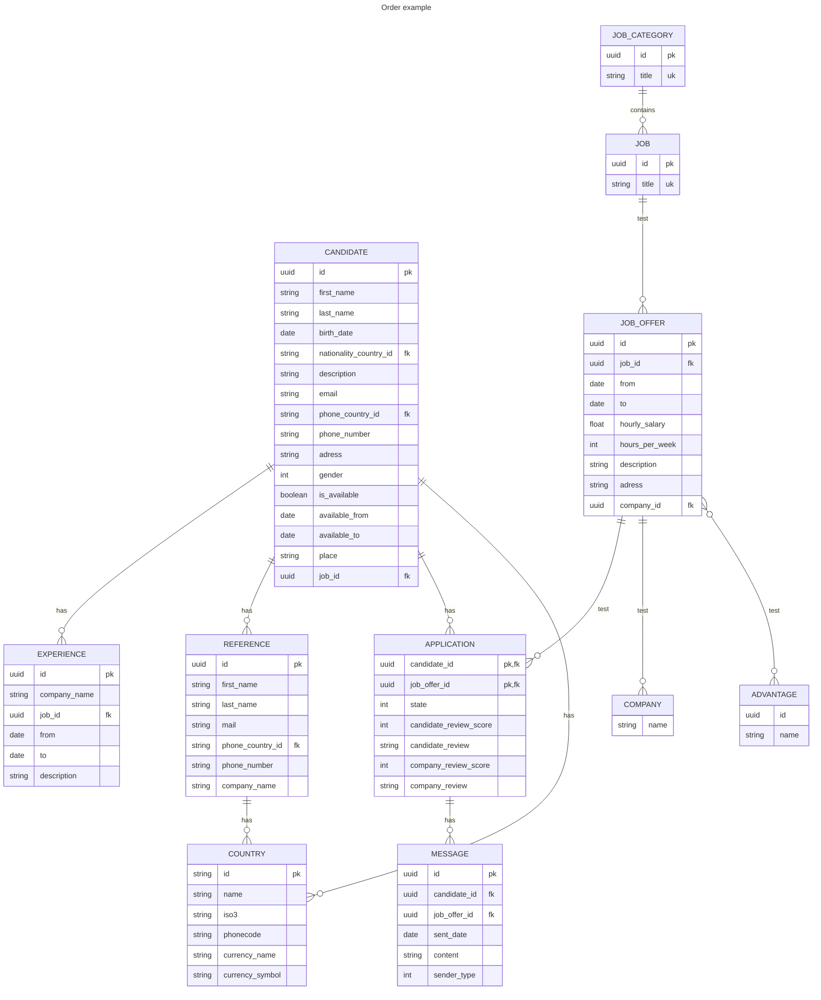

# Database

## Model

```mermaid
---
title: Order example
---
erDiagram
    CANDIDATE ||--o{ EXPERIENCE : has
    CANDIDATE ||--o{ REFERENCE : has
    CANDIDATE ||--o{ APPLICATION : has
    CANDIDATE ||--o{ COUNTRY : has
    REFERENCE ||--o{ COUNTRY : has
    APPLICATION ||--o{ MESSAGE : has
    JOB_OFFER ||--o{ APPLICATION : test
    JOB_OFFER ||--o{ COMPANY : test
    JOB_OFFER }o--o{ ADVANTAGE: test
    JOB ||--o{ JOB_OFFER : test
    JOB_CATEGORY ||--o{ JOB : contains

    CANDIDATE {
      uuid id pk
      string first_name
      string last_name
      date birth_date
      string nationality_country_id fk
      string description

      string email
      string phone_country_id fk
      string phone_number
      string adress
      int gender 

      boolean is_available
      date available_from
      date available_to
      string place
      uuid job_id fk
    }

    EXPERIENCE {
      uuid id pk
      string company_name
      uuid job_id fk
      date from
      date to
      string description
    }

    REFERENCE {
      uuid id pk
      string first_name
      string last_name
      string mail
      string phone_country_id fk
      string phone_number
      string company_name
    }

    APPLICATION {
      uuid candidate_id pk,fk
      uuid job_offer_id pk,fk
      int state

      int    candidate_review_score
      string candidate_review
      int    company_review_score
      string company_review
    }

    ADVANTAGE {
      uuid id
      string name
    }

    MESSAGE {
      uuid id pk
      uuid candidate_id fk
      uuid job_offer_id fk

      date sent_date
      string content
      int sender_type
    }

    JOB_OFFER {
      uuid id pk
      uuid job_id fk
      date from
      date to
      float hourly_salary
      int hours_per_week
      string description
      string adress
      uuid company_id fk
    }

    COMPANY {
      string name
    }

    JOB_CATEGORY {
      uuid id pk
      string title uk
    }

    JOB {
      uuid id pk
      string title uk
    }

    COUNTRY {
      string id pk
      string name
      string iso3
      string phonecode
      string currency_name
      string currency_symbol      
    }
```
