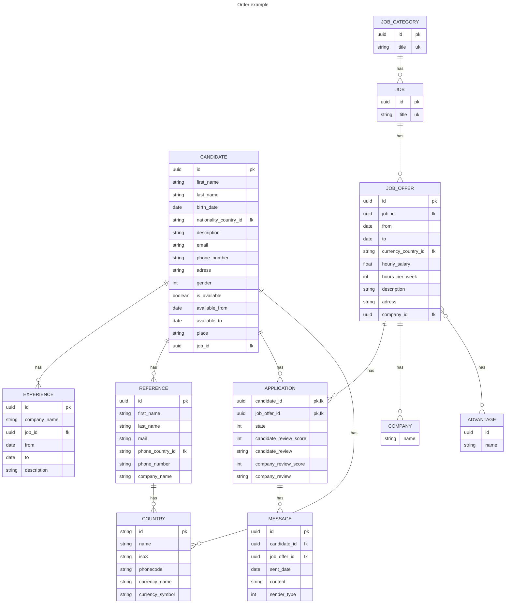
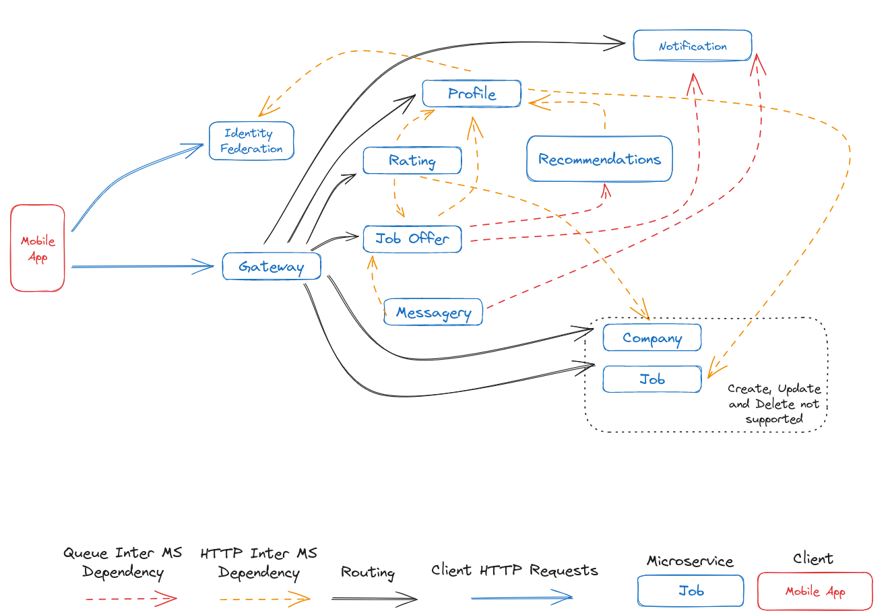
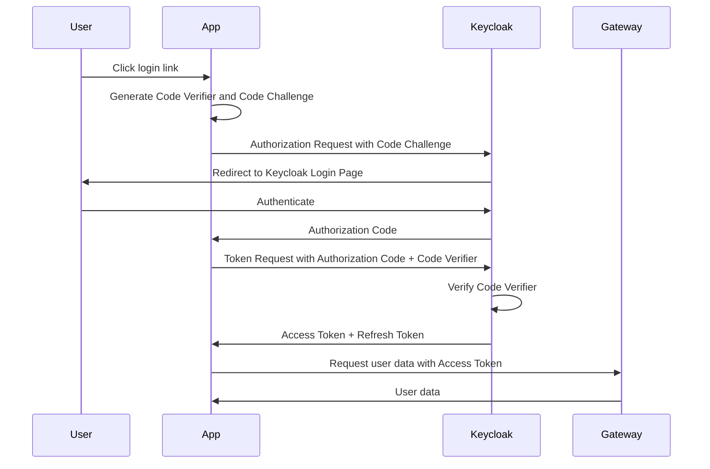
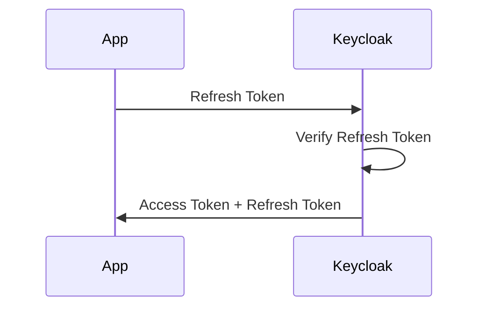
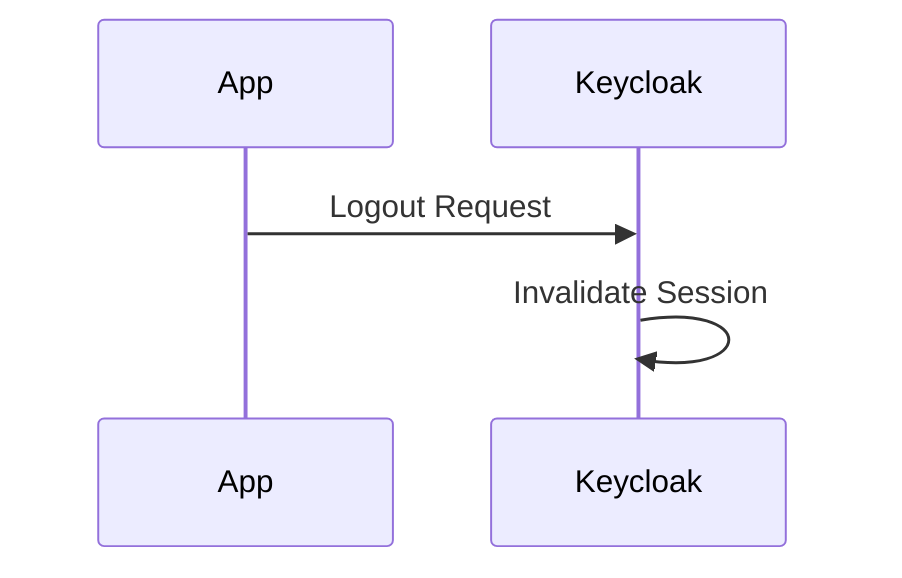

# Season Link

Season link is job board specifically made for seasonal employment. It puts in touch recruiters and candidates.

## User stories

- As a candidate I want to be able to create an account
- As a candidate I want to be able to delete my account
- As a candidate I want to be able to edit my profile
  - Personnal information
  - Contact information
  - Resume
  - Experiences
  - References (people that can vouch for your skills)
- As a candidate I want to be able to view a list of job offers for me
- As a candidate I want to be able to view all job offers
- As a candidate I want to be able to see the a review of companies on a job offer
- As a candidate I want to be able to apply to a job offer
- As a candidate I want to be able to chat with an employer and use an external
- As a candidate I want to stop applying to a job offer
- As a candidate I want to be able to review a company I have worked for
- As a candidate I want to receive notifications when I receive a message (including refusal/granting of a job offer)
- As a candidate I want to be able to view the ratings I have received from my past employers
- As a candidate I want to be able to add a previous experience I've had on season link to my experiences

- As a recruiter I want to be able to leave a review on a worker I've employed through the app
- As a recruiter I want to be able to view a list of candidates based on my subscription
- As a recruiter Platinium recruiter I want to be able to server push an offer to candidates
- As a recruiter I want to be able to refuse / accept a candidate

## Scope

The admin doesn't have an interface, account deletion sends a mail to an admin containing the user's info with a link to delete it.

The recruiters have their own application and we do not manage it. We suppose authentication and authorization concerning them is done through that app.

This includes:

- adding candidate reviews
- consulting candidate lists
- subscriptions
- sending chats
- refusing / granting applicants to their job offers
- creating job offers

Hence, mock API will be created to mimic expected behavior.

## Technical Overview

### Wireframe

The wireframe is a excalidraw file, you can download it <a id="raw-url" href="https://raw.githubusercontent.com/season-link/docs/main/assets/files/2023-10-02-18h13.excalidraw">here</a>.

To view it, go to [Excalidraw](https://excalidraw.com/) and import the file you've downloaded.

### Model

Notes:

- Companies do not hold geographical information, it is the job offer that does.

### Microservices architecture

The gateway is the only entry point to the application. It is responsible for routing requests to the right microservice.

The strategy chosen to cut the application into microservices is to cut it by domain.

The microservices are:

- **Profile**: responsible for managing candidate profiles
- **Company**: responsible for managing company profiles (Not managed by us so we mock it)
- **Job**: responsible for handling jobs and job categories (Not managed by us so we mock it)
- **Job Offer**: responsible for handling job offers and applications (server push, creation, deletion, etc.)
- **Rating**: responsible for handling ratings for both candidates and companies
- **Messagery**: responsible for handling chats between candidates and companies (companies are not managed by us so we mock a behavior a company would have)
- **Notification**: responsible for handling notifications, this includes notifications for messages, pushed job offers, etc.
- **Recommendation**: responsible for handling recommendations for job offers. It replicates the database of the job offer microservice in a graph database and uses it to recommend job offers to candidates.

Authentication and authorization is handled by keycloak, we will call it **Identity Federation**.

### Authentication

Authentication is handled by keycloak. It is an open source identity and access management solution. It is compliant with OpenID Connect (OIDC) and OAuth 2.0.

It is used to authenticate users and manage their permissions.

#### Connection flow

The tokens are then stored in the secure storage of the phone. The refresh token is used to get a new access token when the current one expires or is invalid.

#### Refresh flow

#### Logout flow

#### Inter-microservices authentication

Since the microservices will not be exposed and that the gateway is the only entry point to the application, services will be able to trust each other.

In the future, for increased security, we might consider using a service mesh.

### Database

Each microservice has its own physical database. They will be PostgreSQL databases.

The database of the job offer microservice will be replicated in a graph database for the recommendation microservice.

### Inter-microservices communication

Communication is handled through REST APIs. For a first version, it will be synchronous. This has the advantage of being simple to implement and debug. However, it has the disadvantage of being slow and harder to scale. Service discovery will be not be handled by the gateway but by existing DNS infrastructure (e.g. Kubernetes).

Choosing to use HTTP for communication has the advantage of being simple to implement and debug. However, it has the disadvantage of being slow because of serialization, deserialization and the fact that it is synchronous. This causes the application to be harder to scale, and some requests to timeout.

Errors might also cause the application to be in an inconsistent state. For example, if the job offer microservice fails to create a job offer, the application will be in an inconsistent state because the job offer will be created in the database but the application will not be created. We will have to implement a compensation mechanism to handle this and rollback the changes. Retry mechanisms are also needed to handle temporary failures.

The notification center and recommendations will however, use a message broker, which is asynchronous communication. It will receive messages from other services and process them.

Asynchronous communication has the advantage of being fast and scalable. However, it has the disadvantage of being hard to debug and implement.

Ideally, we would use a message broker for all communication. However, this would require a lot of work and we do not have the time to do it. This is called an event-driven architecture.

### Deployment

For a first version, we will use docker-compose to deploy the application. This has the advantage of being simple to deploy and debug. However, it has the disadvantage of being hard to scale and not being production ready. On top of that there is no service discovery.

For a second version, we will use Kubernetes to deploy the application. This has the advantage of being production ready and scalable.
