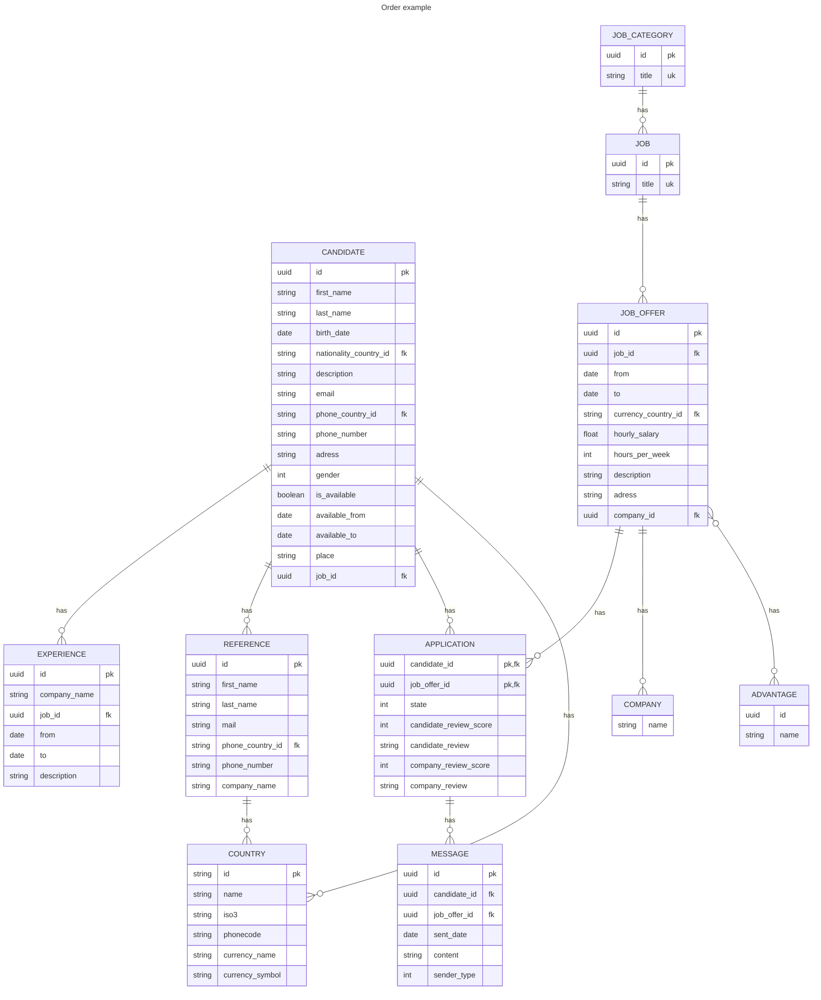

# Season Link

Season link is job board specifically made for seasonal employment. It puts in touch recruiters and candidates.

## User stories

- As a candidate I want to be able to create an account
- As a candidate I want to be able to delete my account
- As a candidate I want to be able to edit my profile
  - Personnal information
  - Contact information
  - Resume
  - Experiences
  - References (people that can vouch for your skills)
- As a candidate I want to be able to view a list of job offers for me
- As a candidate I want to be able to view all job offers
- As a candidate I want to be able to see the a review of companies on a job offer
- As a candidate I want to be able to apply to a job offer
- As a candidate I want to be able to chat with an employer and use an external video-call service
- As a candidate I want to remove my application to a job offer
- As a candidate I want to be able to review a company I have worked for
- As a candidate I want to be notified upon receiving a message (including refusal/granting of a job offer)
- As a candidate I want to be able to view the ratings I have received from my past employers
- As a candidate I want to be able to add a previous experience I've had on season link to my experiences

- As a recruiter I want to be able to leave a review on a worker I've employed through the app
- As a recruiter I want to be able to view a list of candidates based on my subscription
- As a recruiter Platinium recruiter I want to be able to server push an offer to candidates
- As a recruiter I want to be able to refuse / accept a candidate

## Scope

The admin doesn't have an interface, the account deletion process sends a mail to an admin containing the user's info with a link to delete it.

The recruiters have their own application and we do not manage it. We suppose authentication and authorization concerning them is done through that app.

This includes:

- adding candidate reviews
- consulting candidate lists
- subscriptions
- sending chats
- refusing / granting applicants to their job offers
- creating job offers

Hence, a mock API will be created to mimic expected behavior.

## Technical Overview

### Authentication

We aim to use keycloak and OIDC for authentication instead of Spring Security. Keycloak is already compliant and provides a lot of features out of the box and is easy to configure.

### Wireframe

The wireframe is a excalidraw file, you can download it <a id="raw-url" href="https://raw.githubusercontent.com/season-link/docs/main/assets/2023-10-02-18h13.excalidraw">here</a>.

To view it, go to [Excalidraw](https://excalidraw.com/) and import the file you've downloaded.

### Model

Notes:

- Companies do not hold geographical information, it is the job offer that does.
